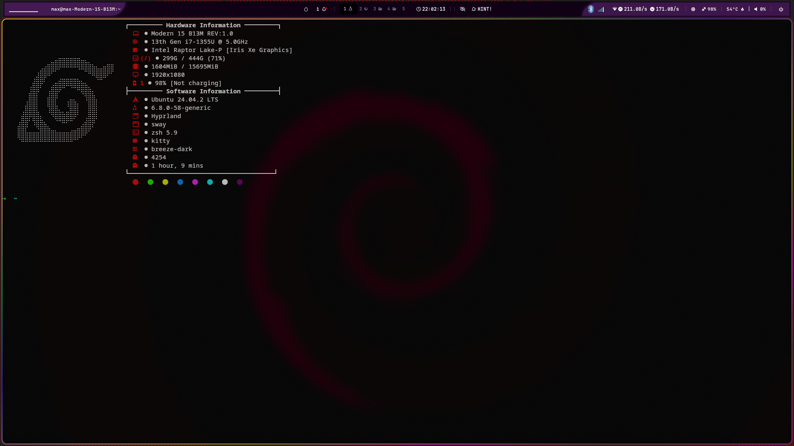

# Hybridfetch – Mi Config. Personal de **Neofetch** 🚀



> Una configuración minimalista de **Neofetch** con iconos *Nerd Fonts* que separa claramente la información de **Hardware** y **Software** usando el estilo de [Hybridfetch](https://github.com/legendlife).

---

## ✨ Características

* Secciones diferenciadas con títulos enmarcados.
* Iconos de [Nerd Fonts](https://www.nerdfonts.com/) para cada campo (CPU, GPU, Disco…).
* Bloques de color que respetan la paleta de tu terminal.
* Salida compacta gracias a opciones *shorthand* (kernel, uptime…).
* Preparado para mostrar batería, GPU dedicada/integrada, DE, WM, paquetes y más.

---

## 📸 Vista previa

```text
┌─────────  Hardware Information ─────────┐
   󰌢  Model: Framework Laptop 13
   󰍛  CPU: Intel i7‑1185G7
   󰘚  GPU: Intel Iris Xe
     Disk: 500G / 1T (49%)
     Memory: 8 GiB / 32 GiB
   󰍹  Resolution: 2256×1504 @ 60 Hz
   󱈑  Battery: 89 %
├─────────  Software Information ─────────┤
     Distro: Arch Linux
     Kernel: 6.9.1‑arch1‑1
     DE: KDE Plasma 6.0.3
     WM: kwin
     Shell: fish 3.7.0
     Terminal: kitty
     Font: JetBrainsMono Nerd Font
   󰀻  Icons: Tela Circle
   󰊠  Packages: 1487
   󰊠  Uptime: 2d 10h 3m
└───────────────────────────────────────┘
```

*Los valores son de ejemplo; tu hardware/software real aparecerá cuando ejecutes `neofetch`.*

---

## 🛠️ Instalación

1. **Clona o descarga** este repositorio:

   ```bash
   git clone [https://github.com/<TU‑USUARIO>/<TU‑REPO>.git](https://github.com/Mxz-11/Neofetch_config.git)
   ```
2. **Copia** el archivo de configuración:

   ```bash
   mkdir -p ~/.config/neofetch
   cp config.conf ~/.config/neofetch/config.conf
   ```
3. **Instala una Nerd Font** (p. ej. [JetBrainsMono Nerd Font](https://github.com/ryanoasis/nerd-fonts/releases)) y selecciónala en tu terminal.
4. Abre una nueva ventana de terminal y ejecuta:

   ```bash
   neofetch
   ```

> **Tip:** Si quieres usar un logo ASCII diferente, cambia `ascii_distro` en `config.conf` o usa `--ascii_distro "nombre"` al invocar `neofetch`.

---

## 💡 Personalización rápida

| Variable           | Qué hace                              | Ejemplo                   |
| ------------------ | ------------------------------------- | ------------------------- |
| `colors`           | Paleta de texto                       | `colors=(4 6 1 8 8 6)`    |
| `block_range`      | Nº de bloques de color                | `block_range=(0 15)`      |
| `image_backend`    | ASCII o imagen (w3m, kitty…)          | `image_backend="w3m"`     |
| `separator`        | Separador entre clave y valor         | `separator=" ->"`         |
| `uptime_shorthand` | Formato abreviado/extendido de uptime | `uptime_shorthand="tiny"` |

Consulta la [wiki oficial](https://github.com/dylanaraps/neofetch/wiki/Customizing-Info) para una lista completa de opciones.

---

## 🙏 Créditos

* Config original *Hybridfetch* por [**legendlife**](https://github.com/legendlife)  — MIT.
* Colección de temas de [**Chick2D**](https://github.com/Chick2D/neofetch-themes).
* Iconos por [**Nerd Fonts**](https://www.nerdfonts.com/).

---

## 📜 Licencia

Este repositorio se distribuye bajo la licencia **MIT**.

---

Hecho con ❤️ por **\Mxz-11**
